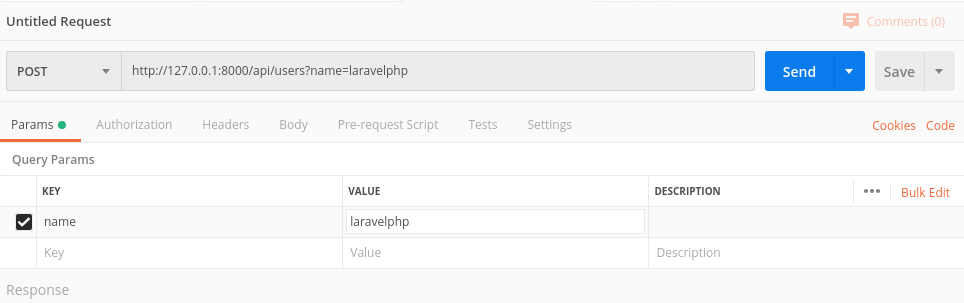
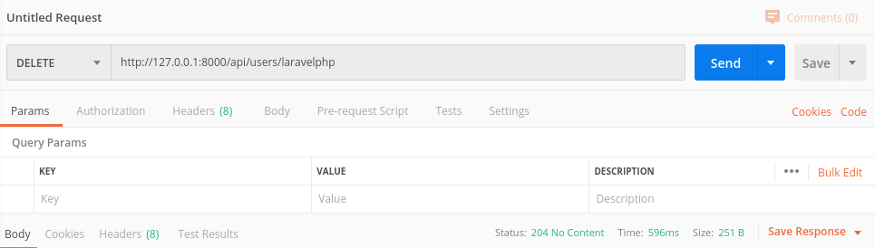
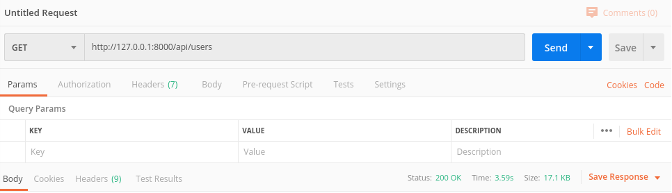

To add user select method POST on link http://127.0.0.1:8000/api/users with Query Params name={usernmae}

Where {username} => name of user you want to add

Example:
    

To delete user select method DELETE with link http://127.0.0.1:8000/api/users/{username}

Where {username} => name of user you want to delete

Example:
    

To add user select method GET on link http://127.0.0.1:8000/api/users

Example:
    

